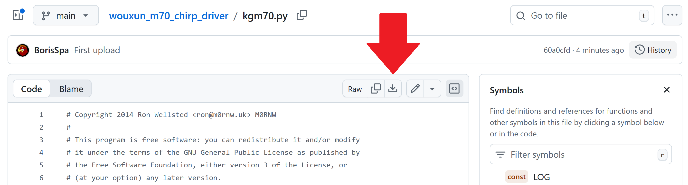
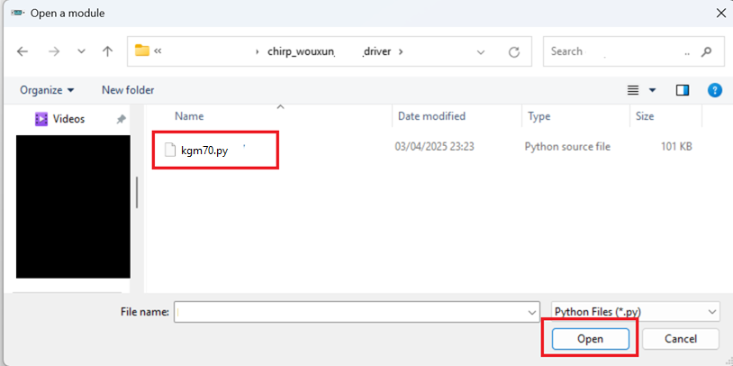
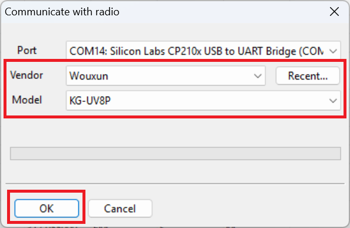
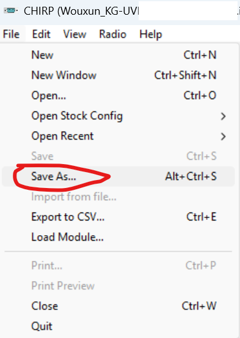
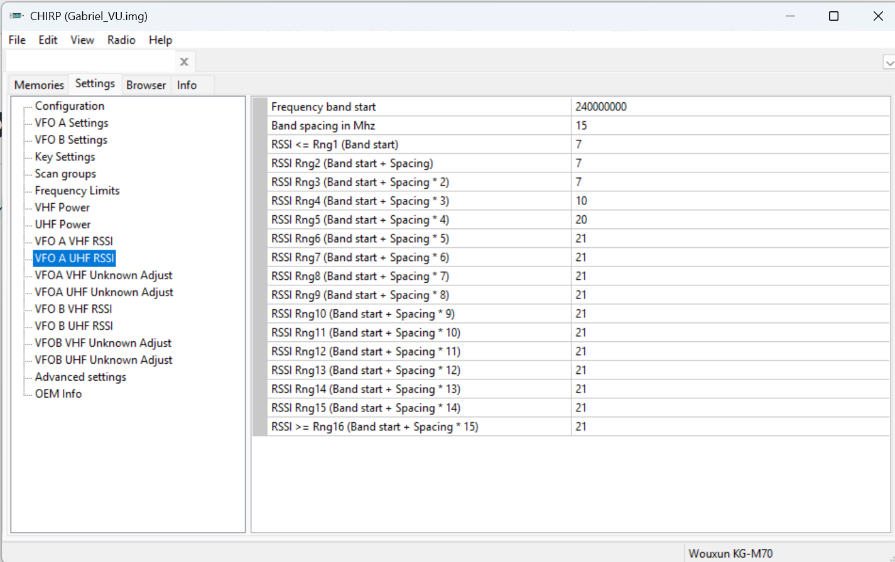
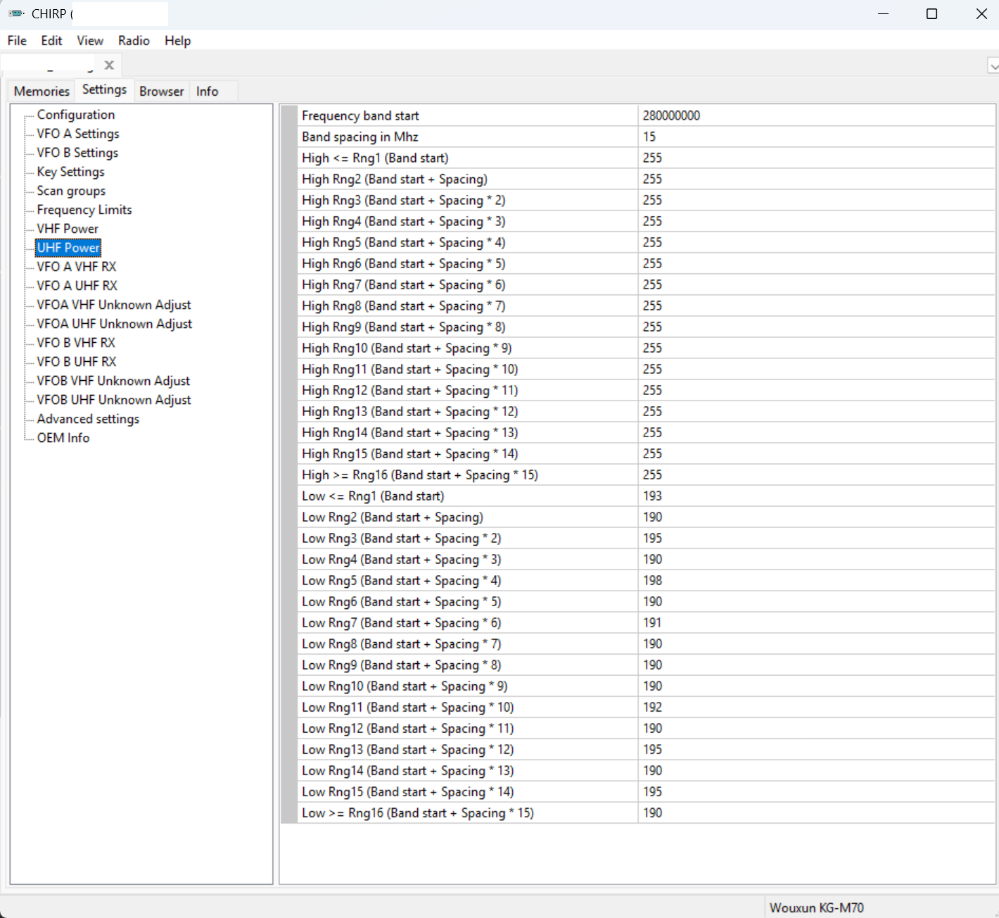

# Chirp driver for the Wouxun KG-M70

This repo consists of a chirp driver for controlling the Wouxun KG-M70 radio.  
This driver works for the standard version of the M70 that (2 meter and 70 cm band) and also with the custom M70 version that wouxun sells trough their email that works on 2 meters and 200-320Mhz (satcom)

----

To run it, please follow this instructions:

1 - Make sure you have a **recent** version Chirp. You can download the latest version from its [official site](https://chirpmyradio.com/projects/chirp/wiki/Download#)

2 - Download the kg-m70 driver from [here](https://github.com/SatcomRadio/wouxun_kgm70_chirp_driver/blob/main/kgm70.py)

You need to press this button to download the file

3 - Open Chirp and enable developer mode

4 - Press ok on the warning and **restart** Chirp. Close the program and open it again

5 - Open the option `File->Load Module`. If this option does not appear, make sure that you've enabled developer mode and **restart** Chirp

6 - Select the driver file you've downloaded in step #2

7 - Select the option `Radio->Download from radio` to read the radio configuration

8 - As the driver is now loaded, the KG-M70 model should be displayed in the dropdown

9 - Make a backup of your file by going to `File->Save As` and save it as `OriginalFW.img`

9 - You can now edit advanced features of the radio such as RX, bands and tx power levels.

10 - Once you are happy with the results go again to `File->Save As` and save it as `ModdedFW.img`

11 - You can now write the changes to the radio by going to `Radio->Upload to radio`

-----

## Band slices

Power levels and RX adjustments are based on band slices.  
Values go **from 0 (minimum) to 255 (maximum)**

Let's say that you define the `Frequency band start` start at `240Mhz` and with a spacing of `15`

Then at the RX levels, each slice would be this equivalent at Mhz

- Range 1 → <=240MHz + 15 * 0 = 240MHz
- Range 2 → 240MHz + 15 * 1 = 255MHz
- Range 3 → 240MHz + 15 * 2 = 270MHz
- Range 4 → 240MHz + 15 * 3 = 285MHz
- Range 5 → 240MHz + 15 * 4 = 300MHz
- Range 6 → 240MHz + 15 * 5 = 315MHz
- Range 7 → 240MHz + 15 * 6 = 330MHz
- Range 8 → 240MHz + 15 * 7 = 345MHz
- Range 9 → 240MHz + 15 * 8 = 360MHz
- Range 10 → 240MHz + 15 * 9 = 375MHz
- Range 11 → 240MHz + 15 * 10 = 390MHz
- Range 12 → 240MHz + 15 * 11 = 405MHz
- Range 13 → 240MHz + 15 * 12 = 420MHz
- Range 14 → 240MHz + 15 * 13 = 435MHz
- Range 15 → 240MHz + 15 * 14 = 450MHz
- Range 16 → >=240MHz + 15 * 15 = 465MHz

-----

In case you need an original firmware, you can download the original .img files that my radio uses. Both for satcom and also for the commercial version.

If you want to open a commercial M70 for making it work on satcom you'll need to adjust both VFO A and VFOB RX as in the previous picture and the power levels as shown in this picture

